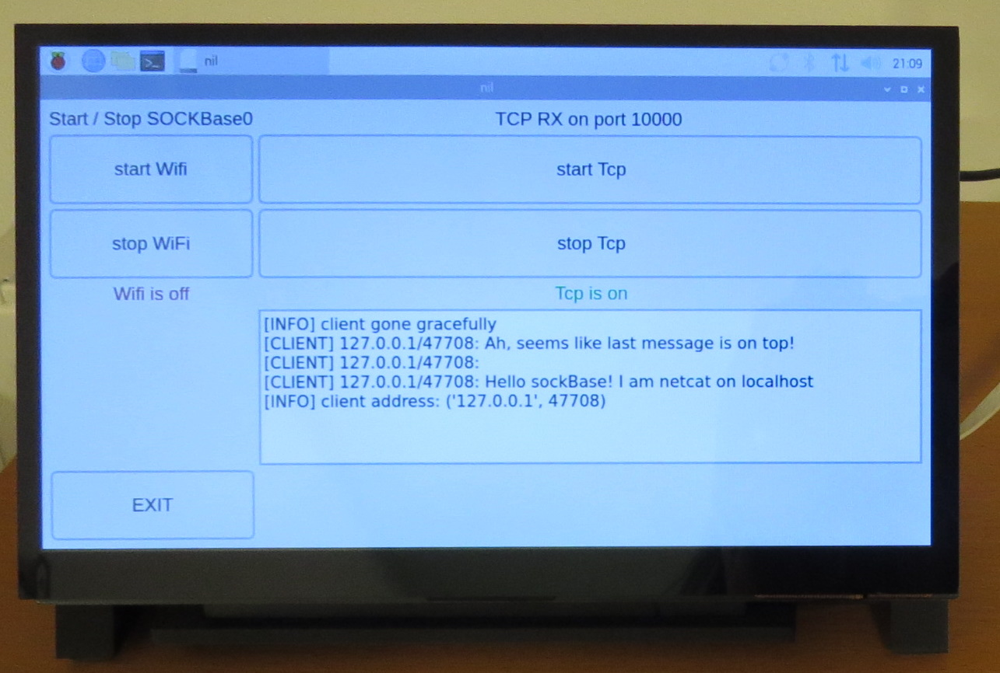
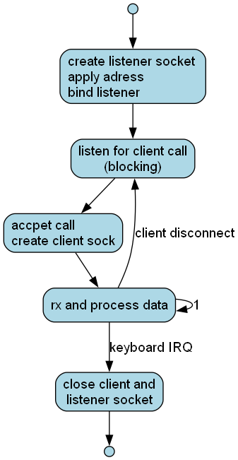

# sockBaseQt

a python based tcp server with a GUI  for Debian/Linux on a raspberry \
intended to provide a receiver for tcp wifi nodes

### running on a Raspberry 4
{width=60%}

### process graph of the underlying tcpSrv.py \

### preparing raspi as WiFi hotshpot
	sudo raspi-config -> WiFi country to AT
	sudo bash setupWifi.sh
 
#### startHorstBlocking.sh, typically inside a screen 
	sudo chmod +x startHorstBlocking.sh

